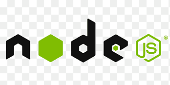
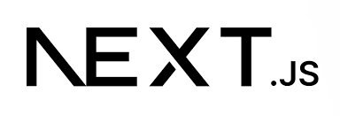

- 👋 Hi, I’m @Sandeep-morya
- 📃 My Github contributions
 

- ❤️ The libraries, i Know are listed below:

&nbsp;
&nbsp;
&nbsp;
&nbsp;
&nbsp;
&nbsp;
&nbsp;
&nbsp;
&nbsp;
&nbsp;
&nbsp;
&nbsp;
&nbsp;
&nbsp;
&nbsp;
&nbsp;
&nbsp;

&nbsp;
&nbsp;
&nbsp;
&nbsp;
&nbsp;
&nbsp;

- Website is live on : https://sandeep-morya.vercel.app/
